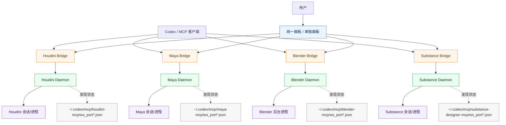

# DCC MCP (Houdini / Maya / Blender / Substance)

面向 DCC 生产流程的 MCP 工具集（支持 `Codex` / Claude Code 等客户端）。

核心目标：
- 一个统一控制面板，管理四套 DCC MCP
- 后台常驻 daemon，避免短生命周期桥接进程不稳定
- GUI 和 MCP 客户端可同时工作
- 面板默认不自动弹出，需要时手动打开

支持：
- Houdini
- Maya
- Blender
- Substance Designer

## Quick Start（推荐）

### 1. 环境准备

- Python 3.11+
- 已安装对应 DCC（Houdini / Maya / Blender / Substance Designer）
- 一个 MCP 客户端（Codex / Claude Code / 其他）

### 2. 启动统一面板（按需）

```bash
python run_unified_gui.py
```

或双击：

```text
启动DCC-MCP.bat
```

### 3. 在面板中检查状态

对每个 DCC：
- 模块开关（启动/关闭 daemon）
- 心跳检测（运行中/未响应/未启动/关闭）
- 查看调用日志（自动加载历史）

### 4. 配置 MCP 客户端

在客户端配置里指向各桥接脚本（示例见下文 `Codex Config Example`）。

## Architecture

每个 DCC 都是两层结构：

1. `*_mcp.daemon_server`  
常驻本地后台，负责真实 DCC 会话与状态维护。

2. `*_mcp.server_with_gui`  
轻量 MCP bridge（stdio），将工具调用转发到 daemon。

这样可避免 GUI 与 MCP 客户端争抢同一进程。

### 中文架构图（统一面板 + 四后端）



### 中文链路图（以 Blender 为例）


## What You Get

- Stable daemon-driven control plane
- GUI + Codex can work at the same time
- Auto daemon bootstrap when launching GUI/bridge
- Unified control panel for all 4 DCCs
- Pipeline-oriented MCP tools for batch/workflow/validation/publish
- 可选模块面板 + 心跳状态 + 日志聚合（打开时自动加载历史）
- DCC 截图工具（Houdini/Maya/Blender/Substance）
- DCC 导入模型/贴图流程工具
- Houdini Unity FBX 导出（内嵌贴图）

## New Pipeline Tools（所有 DCC Bridge 通用）

以下工具已在 Houdini / Maya / Blender / Substance 四套 bridge 中统一提供：

- `workflow_run`：按步骤顺序执行工具链，支持失败即停
- `batch_run`：批量执行操作，支持失败继续
- `validate_asset`：资产路径/扩展名/命名规则/体积基础校验
- `publish_asset`：发布资产到目标目录并可生成 manifest
- `get_job_status`：查询任务状态，支持按 `job_id` 获取详细结果

### workflow_run 示例

```json
{
  "steps": [
    {"operation": "import_geometry", "params": {"input_path": "C:/tmp/in.fbx", "output_blend": "C:/tmp/work.blend"}},
    {"operation": "merge_by_distance", "params": {"input_blend": "C:/tmp/work.blend", "output_blend": "C:/tmp/clean.blend", "distance": 0.0001}},
    {"operation": "export_fbx", "params": {"input_blend": "C:/tmp/clean.blend", "output_path": "C:/tmp/out.fbx"}}
  ],
  "stop_on_error": true,
  "workflow_name": "blender_clean_export"
}
```

## New DCC Tools（最近新增）

### 导入模型
- Houdini: `import_model`（支持 normalize_normals / center_to_origin / uniform_scale）
- Blender: `import_model`（支持 apply_transform / merge_by_distance / recalc_normals / auto_triangulate）
- Maya: `import_geometry` / `import_model`（支持 namespace / group / freeze / center / scale 等）

### Substance 贴图
- `import_texture`：导入贴图到输出目录（可转格式/改分辨率）
- `process_texture`：基础处理（亮度/对比度/锐化/模糊/slope blur 等）

### 截图
- Houdini / Maya / Blender / Substance: `capture_screenshot`

### Unity 友好导出
- Houdini: `export_unity_fbx`（FBX + 内嵌贴图 + 轴系转换）

### Houdini 模板化 HDA（Phase 1）
- `get_template_catalog`：查询可用模板及参数 schema
- `plan_hda_from_prompt`：自然语言 -> 模板与参数计划（启发式）
- `build_hda_from_template`：模板实例化 + 参数/图校验 + dry run + HDA封装
- `build_hda_from_prompt`：自然语言一键生成 HDA
- `get_node_graph_summary`：节点图摘要（限深度）
- `validate_graph`：结构与可执行校验
- `validate_params`：模板参数规则校验
- `dry_run_cook`：执行预校验
- `repair_graph`：自动修复 OUT/flag 等基础结构问题
- `generate_hda_ui`：按模板生成规范参数面板（可复用控制项）

## Run Modes

### 统一面板
- `python run_unified_gui.py`（默认不自动弹出）
- `启动DCC-MCP.bat`
- Desktop shortcut: `DCC_MCP_Control.lnk`

### 单 DCC 面板
- Houdini: `python run_gui.py`
- Maya: `python run_maya_gui.py`
- Blender: `python run_blender_gui.py`
- Substance: `python run_substance_gui.py`

### MCP Bridge（供客户端调用）
- Houdini: `houdini_mcp/server_with_gui.py`
- Maya: `maya_mcp/server_with_gui.py`
- Blender: `blender_mcp/server_with_gui.py`
- Substance: `substance_mcp/server_with_gui.py`

### Verification
- `python verify_codex_setup.py`

## Runtime State（运行态文件）

Daemon state files are written under:

- Houdini: `~/.codex/mcp/houdini-mcp/`
- Maya: `~/.codex/mcp/maya-mcp/`
- Blender: `~/.codex/mcp/blender-mcp/`
- Substance: `~/.codex/mcp/substance-designer-mcp/`

Each contains:
- `.running.lock`
- `ws_port.json`
- `ws_port_<pid>.json`

## Codex Config Example（手动配置）

```toml
[mcp_servers.houdini_mcp]
command = "python"
args = ["-u", "C:/Users/wepie/dcc-mcp/houdini_mcp/server_with_gui.py"]

[mcp_servers.maya_mcp]
command = "python"
args = ["-u", "C:/Users/wepie/dcc-mcp/maya_mcp/server_with_gui.py"]

[mcp_servers.blender_mcp]
command = "python"
args = ["-u", "C:/Users/wepie/dcc-mcp/blender_mcp/server_with_gui.py"]

[mcp_servers.substance_designer_mcp]
command = "python"
args = ["-u", "C:/Users/wepie/dcc-mcp/substance_mcp/server_with_gui.py"]
```

## Usage Notes

- 建议优先从统一面板启动，这样会自动拉起/修复 daemon。
- 场景文件路径建议使用绝对路径（便于跨工具联动和排错）。
- 当前项目使用的是 `MCP 协议 + FastMCP 实现层`。
- 如需自动弹出 GUI：设置环境变量 `DCC_MCP_AUTO_OPEN_GUI=1`。

## Blender Notes

Default Blender path used by launcher:
- `D:/常用软件/Blender 4.2/blender.exe`

More details:
- `BLENDER_SETUP.md`

## Troubleshooting

1. 客户端连不上：
- 先开统一面板，看对应 DCC 是否显示在线。
- 执行“测试 MCP 连接”。
- 再检查客户端配置路径是否为 `C:/Users/wepie/dcc-mcp/...`。

2. 状态异常或旧进程残留：
- 点击“清理旧进程”后，再“重启 MCP 服务器”。

3. 想做基础自检：
- `python verify_codex_setup.py`

## Related Docs

- `CODEX_SETUP.md`
- `README_GUI.md`
- `MAYA_SETUP.md`
- `SUBSTANCE_SETUP.md`
- `BLENDER_SETUP.md`
- `使用说明.md`
