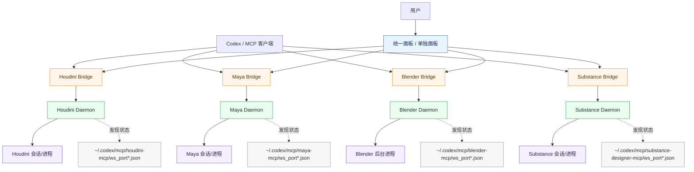

# DCC MCP (Houdini / Maya / Blender / Substance)

Unified DCC MCP toolkit for `Codex`, based on **persistent local daemons**.

Supported DCCs:
- Houdini
- Maya
- Blender
- Substance Designer

## Architecture

Each DCC uses the same two-layer model:

1. `*_mcp.daemon_server`  
Persistent local backend. Owns GUI control channel and DCC session/runtime state.

2. `*_mcp.server_with_gui`  
Lightweight stdio MCP bridge for `Codex`. Forwards tool calls to daemon.

This avoids short-lived MCP subprocess issues and keeps GUI + MCP stable.

### 中文架构图（统一面板 + 四后端）



### 中文链路图（以 Blender 为例）


## What You Get

- Stable daemon-driven control plane
- GUI + Codex can work at the same time
- Auto daemon bootstrap when launching GUI/bridge
- Unified control panel for all 4 DCCs

## Main Entry Points

### Unified panel
- `python run_unified_gui.py`
- `启动统一MCP面板.bat`
- Desktop shortcut: `DCC_MCP_Control.lnk`

### Per-DCC GUI
- Houdini: `python run_gui.py`
- Maya: `python run_maya_gui.py`
- Blender: `python run_blender_gui.py`
- Substance: `python run_substance_gui.py`

### MCP bridge (for Codex)
- Houdini: `houdini_mcp/server_with_gui.py`
- Maya: `maya_mcp/server_with_gui.py`
- Blender: `blender_mcp/server_with_gui.py`
- Substance: `substance_mcp/server_with_gui.py`

### Verification
- `python verify_codex_setup.py`

## Runtime State

Daemon state files are written under:

- Houdini: `~/.codex/mcp/houdini-mcp/`
- Maya: `~/.codex/mcp/maya-mcp/`
- Blender: `~/.codex/mcp/blender-mcp/`
- Substance: `~/.codex/mcp/substance-designer-mcp/`

Each contains:
- `.running.lock`
- `ws_port.json`
- `ws_port_<pid>.json`

## Codex Config Example

```toml
[mcp_servers.houdini_mcp]
command = "python"
args = ["-u", "C:/Users/wepie/dcc-mcp/houdini_mcp/server_with_gui.py"]

[mcp_servers.maya_mcp]
command = "python"
args = ["-u", "C:/Users/wepie/dcc-mcp/maya_mcp/server_with_gui.py"]

[mcp_servers.blender_mcp]
command = "python"
args = ["-u", "C:/Users/wepie/dcc-mcp/blender_mcp/server_with_gui.py"]

[mcp_servers.substance_designer_mcp]
command = "python"
args = ["-u", "C:/Users/wepie/dcc-mcp/substance_mcp/server_with_gui.py"]
```

## Blender Notes

Default Blender path used by launcher:
- `D:/常用软件/Blender 4.2/blender.exe`

More details:
- `BLENDER_SETUP.md`

## Related Docs

- `CODEX_SETUP.md`
- `README_GUI.md`
- `MAYA_SETUP.md`
- `SUBSTANCE_SETUP.md`
- `BLENDER_SETUP.md`
- `使用说明.md`
